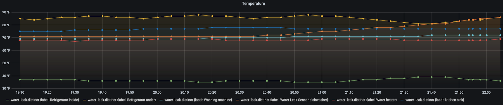

# SmartThings InfluxDB Grafana Application

This application uses **Docker-Compose** to create an application which logs all of your Samsung Smart Things sensors into an Influx database and plots it on Grafana.




## SmartThings API Key

The first step is to create a SmartThings API key which has access
to device statuses and devise lists

1. Create/Log in to your [Samsung Developer's Account](https://graph.api.smartthings.com/)
2. Create a new token at [Samsung Personal Access Tokens](https://account.smartthings.com/tokens)
3. Create a token with permissions to  (devices) list all devices, see all devices, (profiles) see all device profiles, and see locations

## OpenWeather API Key and City ID

1. Create/Log in to [OpenWeather](https://openweathermap.org/api) 
2. Create an API key for your account [API keys](https://home.openweathermap.org/api_keys)
3. Find your city ID in OpenWeather by searching for your weather (note: for USA cities it is `City, US`, not `City, State`).  The city ID should be in the URL

## Docker Deployment

A `docker-compose.yml` file is provided to set up all the required containers.  

1. Install Docker on your system 
2. Create a `.env` file with an environment variable `SMARTTHINGS_API_KEY` set to your API key
3. Add environment variables for `INFLUX_VOLUME` and `GRAFANA_VOLUME` paths to local directories
3. Run `docker-compose up -d`

Sample `.env` file:

```
SMARTTHINGS_API_KEY=xxxxxxxx-xxxx-xxxx-xxxx-xxxxxxxxxxxx
INFLUX_VOLUME="/home/me/smarthings_volume/influxdb"
GRAFANA_VOLUME="/home/me/smarthings_volume/grafana"
OPENWEATHER_API_KEY=xxxxxxxxxxxxxxxxxxxxxxxxxxxxxxxx
OPENWEATHER_CITY_ID=1234567
```

## Local Python Development setup

1. Create a virtual environment: `python -m venv /path/to/env`
2. Activate the virtual environment `source /path/to/env/bin/activate`
3. Install all dependencies `pip install -r requirements.txt`